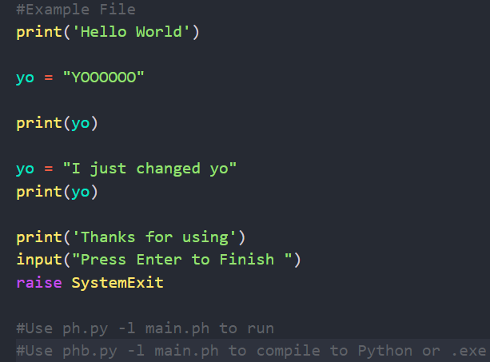
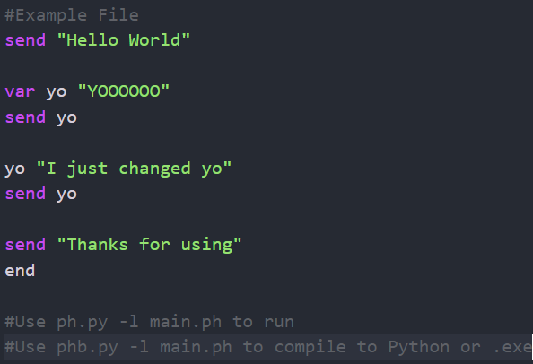

<h1 align="center">PhCode 2</h1>

<p align="center">
    
</p>

*The worst programing language ever.* - me

---
## Sample Code

```python
#This sends a message to the console
send "Hello World"

#This creates and sends a variable
var hello "Hello World"
send hello

end
#So that the terminal doesn't close at the end.
```

---

## How to use

1. Download the source code.
2. Download the VSCODE Extension [here](https://marketplace.visualstudio.com/items?itemName=Phoneguytech75.phcode)
3. Add the source to the path.
4. you can now run PhCode
   
---

## How to Export

WIP

---

## Comparison (Python vs PhCode)

<p>
    <strong>
        Python:
    </strong>
    
</p>

<p>
    <strong>
        PhCode:
    </strong>
    
</p>